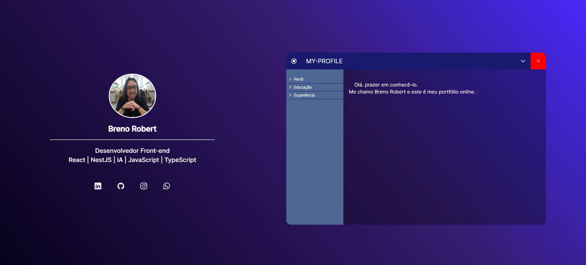

<h1 align="center"> DevLinks </h1>

<h3 align="center">Front-end Developer</h3>

  <a href="#project">Project</a>&nbsp;&nbsp;|&nbsp;&nbsp;
  <a href="#tecnologies">Tecnologies</a>&nbsp;&nbsp;|&nbsp;&nbsp;
  <a href="#languages">Languages</a>&nbsp;&nbsp;|&nbsp;&nbsp;
  <a href="#frameworks">Frameworks</a>&nbsp;&nbsp;|&nbsp;&nbsp;
  <a href="#education">Education</a>&nbsp;&nbsp;|&nbsp;&nbsp;
  <a href="#license">License</a>&nbsp;&nbsp;|&nbsp;&nbsp;
  <a href="#references">References</a>

  

 

## Project

This project was developed to showcase my skills and competencies. So that other people can get to know me and my journey to get where I am.

Contains my social networks to learn about myself and my projects, containing my professional experiences and academic studies.

### Tecnologies

This project was built with three main technologies:

- HTML
- CSS
- JavaScript

Versions with:

- Git
- GitHub

### Languages

- HTML
- CSS
- JavaScript
- TypeScript
- PHP
- Java
- C#

### Frameworks

- Bootstrap
- JQuery
- ReactJS
- React Native / Expo
- NestJS
- Laravel

### Education

- HighSchool - Profª Ana Cândida Barros Molina (2014 - 2016)
- English - Hugle Education (2017 - 2020)
- System Development - SENAI (2019 - 2021)
- Analysis and Systems Development - UNIP (2021 - 2023)

## License

This project is under the MIT license.

---

## References

- [Ion-icons](https://ionic.io/ionicons) by Ionic.

- [Typed.js](https://github.com/mattboldt/typed.js/) library by mattboldt.

- [Flipper](https://www.treinaweb.com.br/blog/css-aprenda-a-criar-o-efeito-de-flip-cards) tip to create your custom flipper.

- [Accordion](https://codepen.io/raubaca/pen/PZzpVe) tip to create your accordion animation.

- [Float animation](https://www.youtube.com/watch?v=BTQHO-yP-CA) simple float animation with keyframes.

- [Discover](https://www.rocketseat.com.br/discover) project from Rocketseat.
